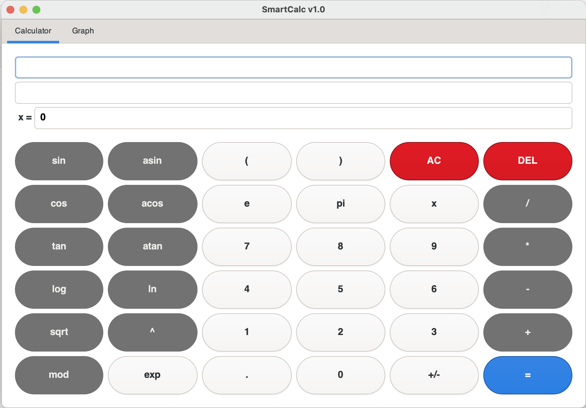
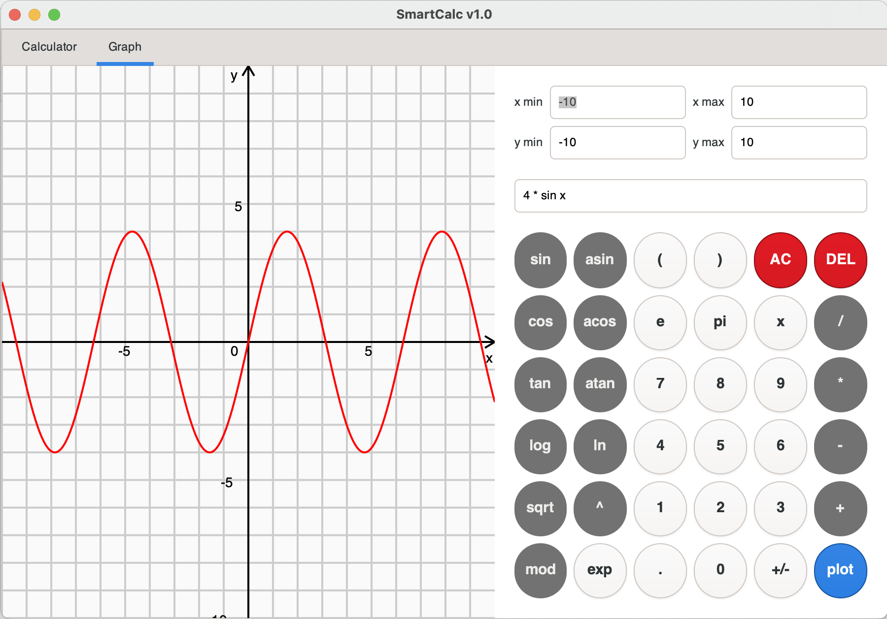

## SmartCalcGtkC
В данном проекте реализована расширенная версия обычного калькулятора, который можно найти в стандартных приложениях каждой операционной системы. Помимо базовых арифметических операций, как плюс-минус и умножить-поделить, калькулятор дополнен возможностью вычисления арифметических выражений с учетом приоритетов, а так же некоторыми математическими функциями (синус, косинус, логарифм и т.д.). Помимо вычисления выражений калькулятор так же поддерживает использование переменной _x_ и построение графика соответствующей функции.
### Интерфейс
<br>

### Реализация
- Программа разработана на языке Си стандарта C11 с использованием компилятора gcc.
- Сборка программы настроена с помощью Makefile со стандартным набором целей для GNU-программ: all, install, uninstall, clean, dvi, dist, test, gcov_report. Установка производится в каталог build в директории проекта. Для запуска программы предусмотрена цель _start_ в Makefile
- Программа разработана в соответствии с принципами структурного программирования
- Код соответствует Google Style
- Обеспечено покрытие unit-тестами модулей, связанных с вычислением выражений, с помощью библиотеки Check
- Реализация с графическим пользовательским интерфейсом на базе GUI-библиотеки GTK4
- На вход программы могут подаваться как целые числа, так и вещественные числа, записанные через точку. Также обрабатывается ввод чисел в экспоненциальной записи
- Вычисление производится после полного ввода вычисляемого выражения и нажатия на символ `=`
- Вычисляются произвольные скобочные арифметические выражения в инфиксной нотации
- Возможна подстановка значения переменной _x_ в виде числа
- Построение графика функции, заданной с помощью выражения в инфиксной нотации с переменной _x_  (с координатными осями, отметкой используемого масштаба и сеткой с адаптивным шагом)
- Область определения и область значения функций ограничиваются по крайней мере числами от -1000000 до 1000000
- Проверяемая точность дробной части - минимум 7 знаков после запятой
- У пользователя есть возможность ввода до 255 символов
- Скобочные арифметические выражения в инфиксной нотации поддерживают следующие арифметические операции и математические функции:
    - **Арифметические операторы**:

        | Название оператора | Инфиксная нотация <br /> (Классическая) | Префиксная нотация <br /> (Польская нотация) |  Постфиксная нотация <br /> (Обратная польская нотация) |
        | ------ | ------ | ------ | ------ |
        | Скобки | (a + b) | (+ a b) | a b + |
        | Сложение | a + b | + a b | a b + |
        | Вычитание | a - b | - a b | a b - |
        | Умножение | a * b | * a b | a b * |
        | Деление | a / b | / a b | a b \ |
        | Возведение в степень | a ^ b | ^ a b | a b ^ |
        | Остаток от деления | a mod b | mod a b | a b mod |
        | Унарный плюс | +a | +a | a+ |
        | Унарный минус | -a | -a | a- |

    - **Функции**:
  
        | Описание функции | Функция |   
        | ---------------- | ------- |  
        | Вычисляет косинус | cos(x) |   
        | Вычисляет синус | sin(x) |  
        | Вычисляет тангенс | tan(x) |  
        | Вычисляет арккосинус | acos(x) | 
        | Вычисляет арксинус | asin(x) | 
        | Вычисляет арктангенс | atan(x) |
        | Вычисляет квадратный корень | sqrt(x) |
        | Вычисляет натуральный логарифм | ln(x) | 
        | Вычисляет десятичный логарифм | log(x) |


#### Алгоритм
Входное выражение в инфиксной форме записи преобразуется в обратную польскую нотацию по алгоритму Дейкстры. Алгоритм основан на стеке. В преобразовании участвуют две текстовых переменных: входная и выходная строки. В процессе преобразования используется стек, хранящий ещё не добавленные к выходной строке операции. Преобразующая программа последовательно считывает лексемы из входной строки, выполняя на каждом шаге некоторые действия, зависящие от того, какая лексема была считана.
<br><br>_Реализация алгоритма:_<br>
```
Пока в исходной строке есть необработанные лексемы (простейшая единица морфологического разбора выражения, например, [2, 3, 5] - числовые лексемы, [/, (, +, ), *] - лексемы-операции), считываем очередную:

Если лексема:
- Число - добавляем в строку вывода.
- Функция или открывающая скобка - помещаем в стек.
- Разделитель аргументов функции (например, запятая):         
    - Перекладываем операторы из стека в выходную очередь пока лексемой на вершине стека не станет открывающая скобка. Если в стеке не окажется открывающей скобки - в выражении допущена ошибка.
- Оператор (O1):
    - Пока присутствует на вершине стека лексема-оператор (O2) чей приоритет выше приоритета O1, либо при равенстве приоритетов O1 является левоассоциативным:
        - Перекладываем O2 из стека в выходную очередь.
    - Помещаем O1 в стек.
- Закрывающая скобка:
    - Пока лексема на вершине стека не станет открывающей скобкой, перекладываем лексемы-операторы из стека в выходную очередь.
    - Удаляем из стека открывающую скобку.
    - Если лексема на вершине стека — функция, перекладываем её в выходную очередь.
    - Если стек закончился до того, как была встречена открывающая скобка - в выражении содержится ошибка.

Если во входной строке больше не осталось лексем:
- Пока есть операторы в стеке:
    - Если на вершине стека скобка - в выражении допущена ошибка.
    - Перекладываем оператор из стека в выходную очередь.

Конец.
```
Далее выражение в обратной польской нотации передаётся в функцию вычисления результата.